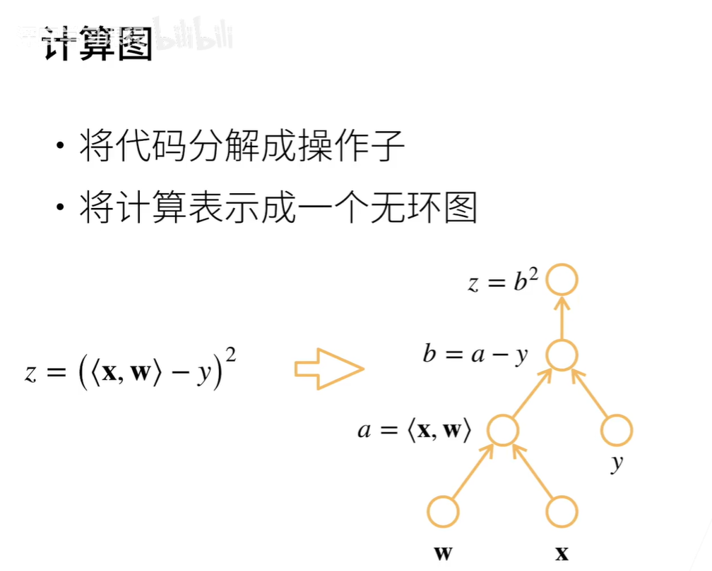
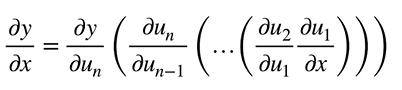

# 自动求导（理论）

## 链式法则求导
1. 链式法则求导例子1

2. 链式法则求导例子2


## 计算图


- 显式构造
```python
# Tensorflow/Theano/MXNet
from mxnet import sym
a = sym.var()
b = sym.var()
c = 2 * a + b
# bind data into a and b later
```
- 隐式构造
```python
# PyTorch/MXNet
from mxnet import autograd, nd
with autograd.record():
    a = nd.ones((2, 1))
    b = nd.ones((2, 1))
    c = 2 * a + b
```

## 自动求导的两种模式
- 都是基于链式法则的求导方法
1. 正向累积（从小到大 x->y）



2. 反向累积（从大到小 y->x）

---
前向：执行图，存储中间结果<br>
反向：从相反方向执行图，去除不需要的枝


## 复杂度
- 计算复杂度: O(n)，n是操作子个数
  - 通常正向和反向的代价类似
- 内存复杂度: O(n)，因为需要存储正向的所有中间结果
- 跟正向累积对比:
  - O(n) 计算复杂度用来计算一个变量的梯度
  - O(1) 内存复杂度

# 自动求导（代码）

## 示例1: 计算 $y=2\mathbf{x}^\top\mathbf{x}$ 关于列向量 $\mathbf{x}$ 的梯度
```python
import torch
x = torch.arange(4.0)
x.requires_grad_(True) # 等价于 x = torch.arange(4.0, requires_grad=True)
y = 2 * torch.dot(x, x)
y.backward() # 自动求导
print(x.grad) # 输出梯度
```

## 示例2: 清除梯度并计算新的梯度
```python
x.grad.zero_() # 清除之前的梯度
y = x.sum()
y.backward()
print(x.grad) # 输出新的梯度
```

## 示例3: 对非标量变量进行反向传播
```python
x.grad.zero_()
y = x * x
# 等价于 y.backward(torch.ones(len(x)))
y.sum().backward()
print(x.grad)
```

## 示例4: 中断依赖关系
```python
x.grad.zero_()
y = x * x
u = y.detach()  # 中断 y 对 x 的依赖关系
z = u * x
z.sum().backward()
print(x.grad == u) # 验证梯度
```

## 示例5: 使用控制流构建计算图
```python
def f(a):
    b = a * 2
    while b.norm() < 1000:
        b = b * 2
    if b.sum() > 0:
        c = b
    else:
        c = 100 * b
    return c

a = torch.randn(size=(), requires_grad=True)
d = f(a)
d.backward()
print(a.grad == d / a) # 验证梯度
```

## 思考
自动求导就是将所有的求导过程给计算机。<br>
在求导之前，要确保是标量，如果是矢量的话，要先sum()变成标量
    